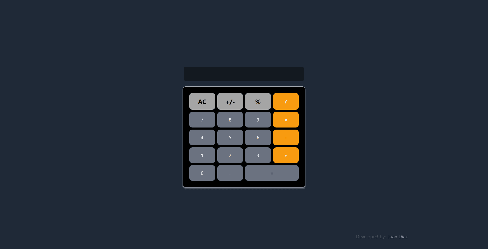

<div id="top"></div>

# Calculator 🧮

This simple project is a responsive web application that allows users to make simple calculations. The project was built as part of the [freeCodeCamp](https://www.freecodecamp.org/) Front End Libraries Certification.

## Description 💡

This project was built as part of the **[freeCodeCamp Front End Libraries Certification](https://www.freecodecamp.org/certification/1diazdev/front-end-development-libraries)**. The goal was to build a responsive web application that allows users to play calculator sounds by pressing keys on their keyboard or by clicking on the buttons on the screen.

<div align="center">

[](https://math.jpdiaz.dev/)
[](https://www.figma.com/community/file/1284214703277704177)
[](https://pr.new/github.com/JuanPabloDiaz/calculator)

</div>

### Desktop View 🖥️



### iPad view 📱


### Mobile view 📱


## Features:

- Responsive design: [calculator](https://math.jpdiaz.dev) adapts to any screen size, ensuring a consistent and enjoyable experience for all users.
- Sleek and modern UI: Tailwind CSS provides a beautiful and intuitive user interface.
- Efficient and performant: Vite.js ensures fast loading times and a smooth experience.
- math operations: addition, subtraction, multiplication, division, and modulo.

### Built With 🔑

Welcome to [calculator](https://math.jpdiaz.dev), a simple calculator build with React, Tailwind CSS and Vite.js.


Here's a closer look at the tech stack:

- Front-End: React.js, Vite.js, Tailwind CSS
- Back-End: N/A
- Deployment: Vercel

## Get started 🛠️

To get started with [calculator](https://math.jpdiaz.dev), simply clone the repository and follow the setup instructions. You'll be up and running in no time!

### Setup 📋

1. Clone the repo
2. Install dependencies
   ```sh
   npm install
   ```
3. Start the development server
   ```sh
   npm run dev
   ```
4. Open [http://localhost:5173/](http://localhost:5173/) with your browser to see the result.

## Contribution 🤝

I welcome contributions to the [calculator](https://math.jpdiaz.dev)! Feel free to fork the repository and submit pull requests with your improvements.

## License 📜

[Calculator](https://math.jpdiaz.dev) is licensed under the MIT License.

I hope you enjoy using this project!

<!-- OTHER PROJECTS -->

## Other Projects 🚀


[](https://github.com/JuanPabloDiaz/platzi/tree/main/2021)
[](https://github.com/JuanPabloDiaz/platzi/tree/main/2022)
[](https://github.com/JuanPabloDiaz/platzi/tree/main/2023)

<!-- CONTACT -->

## Contact 📞

[](https://www.linkedin.com/in/1diazdev/)
[](https://www.twitter.com/1diazdev)
[](mailto:juan.diaz93@hotmail.com)

[](https://platzi.com/p/DiazJuan/)

<!-- ACKNOWLEDGMENTS -->

## Acknowledgments 📚

Resources list that I find helpful and would like to give credit to.

- [FreeCodeCamp - guideline](https://www.freecodecamp.org/learn/front-end-development-libraries/front-end-development-libraries-projects/build-a-javascript-calculator)
- [FreeCodeCamp](https://www.freecodecamp.org/)
- [Tailwind CSS](https://tailwindcss.com/)
- [Vite.js](https://vitejs.dev/)
- [React.js](https://reactjs.org/)
- [Vercel](https://vercel.com/)

<p align="right">(<a href="#top">👆 Top 👆</a>)</p>
